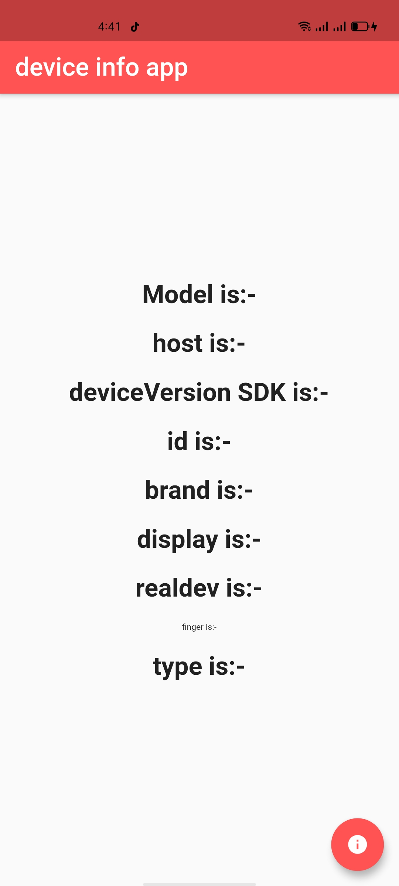
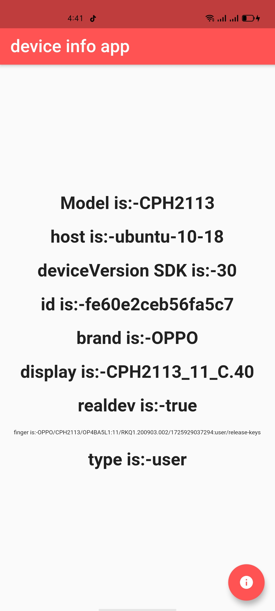

# Mobile Info

<b>Device Details App</b>

## About
Device info app

## Snapshots

| Home Page | info  |
|------|-------|
|||

## Other Flutter Projects
- [music app player external storage read](https://github.com/itsherifAhmed/Music-Player-Read-external-Storage-Flutter-app)
- [Make Up App flutter MVC Getx](https://github.com/itsherifAhmed/MakeUp-App)
- [Speech to Text app flutter](https://github.com/itsherifAhmed/Speech-to-text-app)
- [api flutter project](https://github.com/itsherifAhmed/apiFlutter-Project)
- [qr code app](https://github.com/itsherifAhmed/qr-barcode)
- [facebook UI](https://github.com/itsherifAhmed/facebook-ui-clone)
- [Draw App](https://github.com/itsherifAhmed/draw-app)

